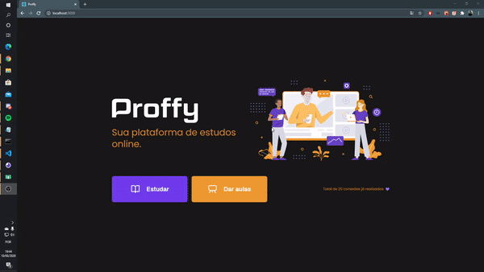

<h1 align="center">
    
</h1>

<h4 align="center"> 
	🚀 NextLevelWeek 2.0 🚀 
</h4>

<p align="center">
	
  

    

  
   
</p>

<p align="center">
  <a href="#rocket-technologies">Technologies</a>&nbsp;&nbsp;&nbsp;|&nbsp;&nbsp;&nbsp;
  <a href="#information_source-how-to-use">How To Use</a>&nbsp;&nbsp;&nbsp;
</p>

## ✏ About
React Native + ReactJS + NodeJS project developed on RocketSeat NexLevelWeek. This project is based on an application for connect students and teachers.


 

## 🛠 Technologies
This project was developed at the RocketSeat NLW#2with the following technologies:

- [Expo]
- [Node.js]
- [React]
- [React-Native]
- [TypeScript]

💡Both 💻Frontend and 📱Mobile need the 🖥Backend to work.

## :information_source: How To Use

To clone and run this application, you'll need [Git](https://git-scm.com), [Node.js v10.16][nodejs] or higher + [Yarn v1.13][yarn] or higher installed on your computer. From your command line:

```bash
# Clone this repository
$ git clone https://github.com/Wheyckson/Proffy.git Proffy

# Go into the repository
$ cd proffy

# Install dependencies
$ yarn install

# Run the app (iOS)
$ react-native run-ios --simulator="iPhone XS Max"

# Run the app (Android)
$ react-native run-android
```

Made with ♥ by Whey :wave: [Get in touch!](https://www.linkedin.com/in/wheyckson-lopes/)
